# M365 Security Audit Dashboard

> **Ein zentrales Security Dashboard das Microsoft 365 Tenants analysiert, Sicherheitsrisiken aufdeckt und mit KI konkrete Handlungsempfehlungen liefert — inklusive Direktlinks zum Beheben.**

[](#infrastruktur-terraform)
[](#infrastruktur-terraform)
[](#cicd-pipeline)

---

## Das Problem

IT-Security in Microsoft 365 ist komplex, teuer und zeitaufwendig:

- **Wissen, wo man hinschauen muss** — Entra ID, Intune, Defender, Conditional Access, Identity Protection — alles verteilt über verschiedene Admin-Portale. Ein Security-Audit bedeutet dutzende Klicks durch verschiedene Dashboards.
- **Security-Experten sind teuer** — Ein erfahrener M365 Security Engineer kostet Unternehmen 80.000-120.000 EUR/Jahr. Viele KMUs können sich das nicht leisten.
- **Risiko, etwas zu übersehen** — Ohne strukturierte Prüfung bleiben Lücken unentdeckt: Admins ohne MFA, veraltete Apps mit zu vielen Berechtigungen, nicht-konforme Geräte, deaktivierte Policies.
- **Keine priorisierten Handlungsempfehlungen** — Microsoft zeigt Daten, aber sagt nicht "das musst du JETZT fixen". IT-Teams verlieren Zeit mit unwichtigen Findings.

## Die Lösung

Dieses Dashboard bündelt **alle sicherheitsrelevanten Daten** aus dem Microsoft 365 Tenant in **einer einzigen Oberfläche** und nutzt **KI-gestützte Analyse** um priorisierte Empfehlungen mit Direktlinks zu generieren:

- **Alles auf einen Blick** statt 10+ Admin-Portale durchklicken
- **KI-Empfehlungen mit Direktlinks** — nicht nur "MFA fehlt", sondern "diese 2 Admins haben kein MFA → Klick hier zum Beheben". Spart Stunden an Recherche
- **Risiken priorisiert** (Hoch/Mittel/Niedrig) — sofort wissen was zuerst behoben werden muss
- **Ersetzt mehrere Security-Experten** — automatisierte Analyse die sonst Tage manueller Arbeit braucht
- **DSGVO-Compliance** eingebaut — Checkliste für alle relevanten Anforderungen

> **Hinweis:** Aus DSGVO-Gründen werden in den Screenshots nur Demo-Daten gezeigt. Nach Anmeldung mit einem echten Microsoft 365 Tenant werden ausschließlich echte Daten aus der Microsoft Graph API geladen. Demo- und Live-Daten werden niemals vermischt.

---

## Screenshots

### Dashboard Overview — Security Score & Zusammenfassung

Secure Score mit Breakdown nach Kategorie, kritische KPIs (MFA, Admins, Policies, Risiko-Benutzer) und aktive Sicherheitswarnungen — alles auf einer Seite.

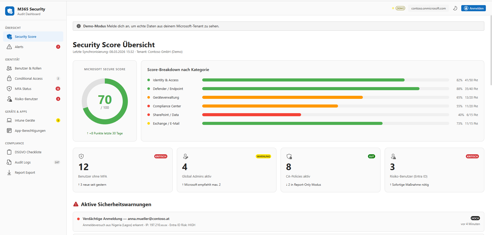

---

### KI Security Empfehlungen — Priorisiert mit Direktlinks

Das Herzstück der App: Die KI analysiert alle Tenant-Daten und generiert **konkrete Empfehlungen mit Priorität und Direktlinks**. Statt selbst herauszufinden wo das Problem liegt und wie man es behebt, klickt man einfach auf den Link und wird direkt zur richtigen Stelle im Azure Portal geführt. **Das spart Stunden an Recherche und Herumklicken.**

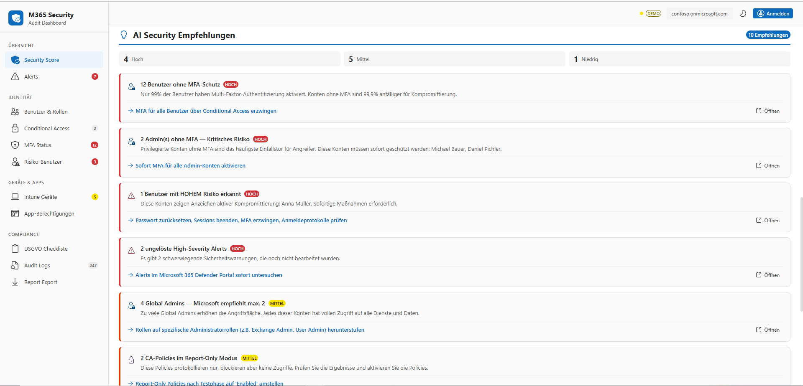

**Was die KI analysiert:**
- MFA-Abdeckung — erkennt Benutzer und vor allem Admins ohne MFA
- Privilegierte Rollen — warnt bei zu vielen Global Admins (Least Privilege)
- Conditional Access Lücken — findet deaktivierte oder fehlende Policies
- Risiko-Bewertung — korreliert Identity Protection Signale mit Benutzerrollen
- Device Compliance — erkennt nicht-konforme oder unverschlüsselte Geräte
- Secure Score — konkrete Schritte zur Verbesserung

---

### Security Alerts — Echtzeit-Warnungen mit Empfohlenen Maßnahmen

Alle Sicherheitswarnungen aus Microsoft Defender und Entra ID Identity Protection. Jede Warnung enthält empfohlene Maßnahmen die direkt umgesetzt werden können.

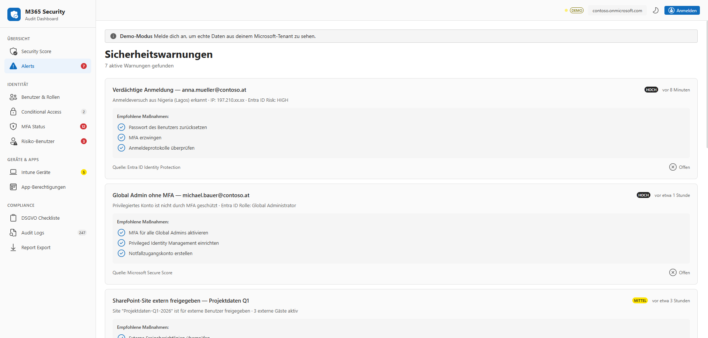

---

### Benutzer & Rollen — Identity & Access Management

Alle Tenant-Benutzer mit MFA-Status, Abteilung und Rollenzuweisungen. Sofort sehen welche Admins kein MFA haben (rot markiert).

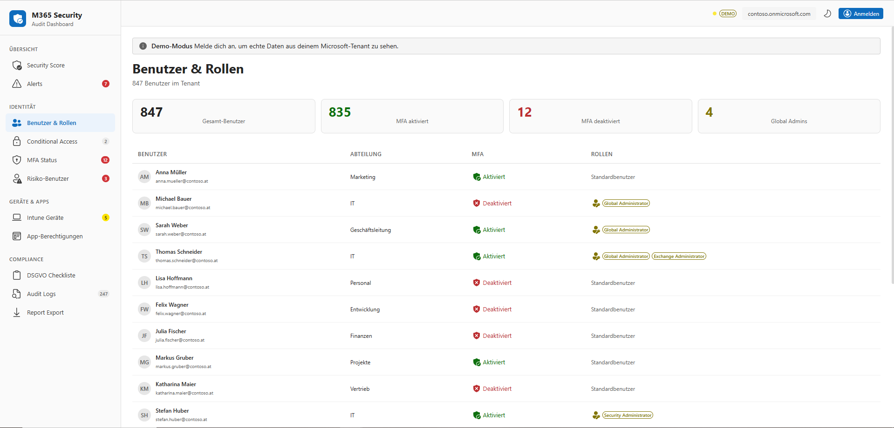

---

### Conditional Access Policies

Übersicht aller CA-Policies mit Status (Aktiv, Report-Only, Deaktiviert). Policies im Report-Only Modus werden als Warnung hervorgehoben.

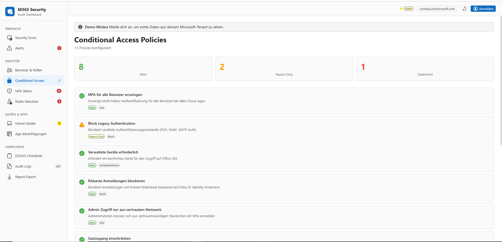

---

### MFA Status — Multi-Faktor-Authentifizierung

MFA-Abdeckung in Prozent, Liste aller Benutzer ohne MFA. Admins ohne MFA werden besonders hervorgehoben da sie das größte Risiko darstellen.

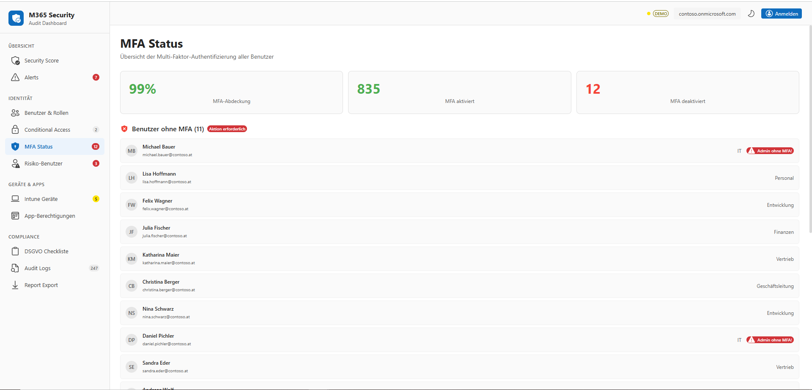

---

### Risiko-Benutzer — Entra ID Identity Protection

Benutzer die von Entra ID als gefährdet eingestuft wurden — mit Risikostufe (Hoch/Mittel/Niedrig), Beschreibung und Status.

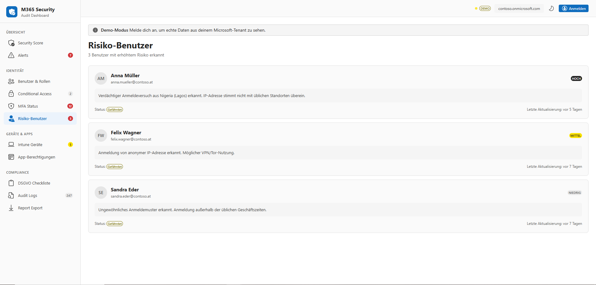

---

### Intune Geräte — Device Compliance & Verschlüsselung

Alle verwalteten Geräte mit Compliance-Status, Betriebssystem, Verschlüsselungsstatus und letztem Sync. Nicht-konforme Geräte werden rot markiert.

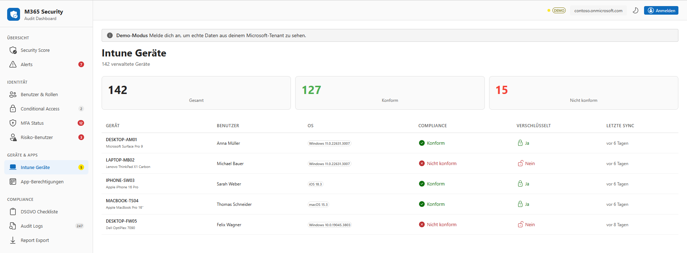

---

### Audit Logs — Verzeichnis-Protokolle

Alle relevanten Aktionen im Tenant: Anmeldungen, Policy-Änderungen, Benutzer-Erstellung, Berechtigungen. Für Compliance-Nachweise und Forensik.

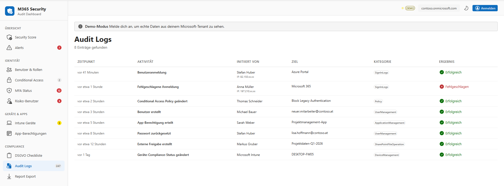

---

### DSGVO Checkliste — Compliance Tracking

Interaktive Checkliste für alle DSGVO-relevanten Anforderungen: Dokumentation, Verträge, technische Maßnahmen, Betroffenenrechte.

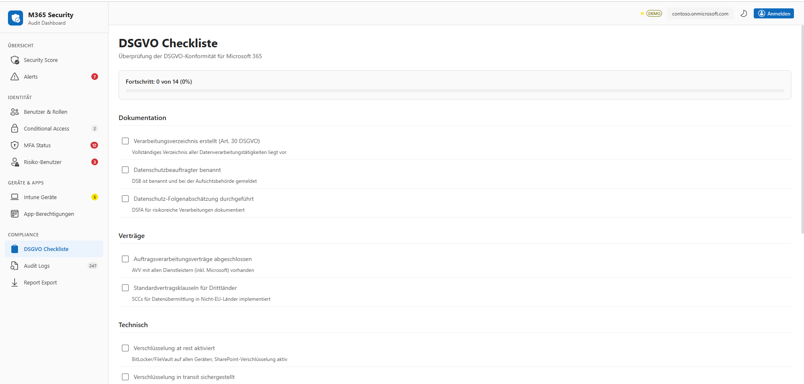

---

### App-Berechtigungen — OAuth Apps im Tenant

Alle registrierten Apps mit ihren Berechtigungen und Risikobewertung. Veraltete Apps mit zu hohen Berechtigungen werden als Hohes Risiko markiert.

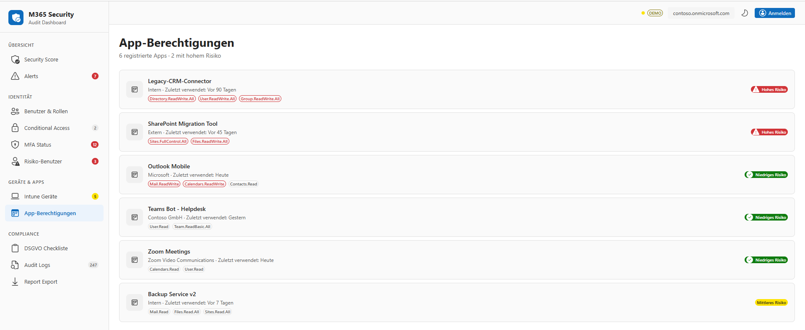

---

## Business Value

| Ohne dieses Dashboard | Mit diesem Dashboard |
|---|---|
| 10+ Admin-Portale durchklicken | **1 Dashboard** mit allen Daten |
| Stunden für ein Security-Audit | **Minuten** — alles automatisch analysiert |
| Risiko, Lücken zu übersehen | **KI findet Lücken** und priorisiert sie |
| Manuell recherchieren wo man fixt | **Direktlinks** — 1 Klick zum Beheben |
| Security-Experte nötig (80-120k/Jahr) | **Automatisierte Analyse** ersetzt manuelle Arbeit |
| Keine DSGVO-Übersicht | **Integrierte DSGVO-Checkliste** |

---

## Architektur

```
┌─────────────────────────────────────────────────────────┐
│                    Azure Static Web Apps                 │
│                  (Next.js Static Export)                  │
│                                                          │
│  ┌──────────┐  ┌──────────────┐  ┌───────────────────┐  │
│  │  Fluent  │  │   MSAL.js    │  │  KI-Empfehlungs-  │  │
│  │  UI v9   │  │  (Auth Flow) │  │     Engine         │  │
│  └──────────┘  └──────┬───────┘  └─────────┬─────────┘  │
│                       │                     │            │
└───────────────────────┼─────────────────────┼────────────┘
                        │                     │
                        ▼                     ▼
              ┌──────────────────┐   ┌──────────────────┐
              │   Microsoft      │   │   Tenant-Daten   │
              │   Entra ID       │   │   analysieren &  │
              │   (Azure AD)     │   │   bewerten       │
              └────────┬─────────┘   └──────────────────┘
                       │
                       ▼
              ┌──────────────────┐
              │  Microsoft Graph │
              │      API         │
              │                  │
              │ • /users         │
              │ • /security      │
              │ • /identityProt  │
              │ • /deviceMgmt   │
              │ • /auditLogs    │
              │ • /authMethods  │
              └──────────────────┘
```

```
┌──────────────────────────────────────────────────────┐
│                Azure Infrastruktur (Terraform)        │
│                                                       │
│  ┌─────────────┐  ┌────────┐  ┌───────────────────┐  │
│  │ Static Web  │  │  VNet  │  │    Key Vault       │  │
│  │    App       │──│ Subnet │──│  (Secrets Mgmt)   │  │
│  │  (Free)     │  │        │  │                    │  │
│  └─────────────┘  └────────┘  └───────────────────┘  │
│                                                       │
│  CI/CD: GitHub Actions → Auto-Deploy bei git push     │
└──────────────────────────────────────────────────────┘
```

---

## Technologie-Stack

### Frontend
| Technologie | Verwendung |
|---|---|
| **Next.js 16** (App Router) | React-Framework mit Static Export |
| **TypeScript** | Type-Safety über die gesamte Codebase |
| **Fluent UI v9** | Microsoft Design System |
| **Recharts** | Datenvisualisierung (Score Trends, Charts) |

### Authentifizierung & API
| Technologie | Verwendung |
|---|---|
| **MSAL.js v5** | OAuth 2.0 / OpenID Connect mit Entra ID |
| **Microsoft Graph API** | Zugriff auf alle M365 Security-Daten |
| **Delegated Permissions** | 8 Scopes für Security, Identity, Devices, Audit |

### Infrastruktur & DevOps
| Technologie | Verwendung |
|---|---|
| **Azure Static Web Apps** | Hosting (Free Tier, $0/Monat) |
| **Azure VNet + Subnet** | Netzwerkisolierung |
| **Azure Key Vault** | Secrets Management |
| **Terraform** | Infrastructure as Code |
| **GitHub Actions** | CI/CD — automatisches Deploy bei `git push` |

---

## Microsoft Graph API Scopes

```
SecurityEvents.Read.All          — Security Alerts & Secure Score
User.Read.All                    — Benutzer & Profile
Policy.Read.All                  — Conditional Access Policies
IdentityRiskyUser.Read.All       — Identity Protection
DeviceManagementManagedDevices.Read.All — Intune Geräte
AuditLog.Read.All                — Audit Logs
Directory.Read.All               — Verzeichnisrollen
UserAuthenticationMethod.Read.All — MFA Status
```

---

## Infrastruktur (Terraform)

Die Azure-Infrastruktur ist komplett als Infrastructure as Code definiert:

```
infra-sec-app/
├── main.tf          # Azure Resources (SWA, VNet, Subnet, Key Vault)
├── variables.tf     # Parameter
└── outputs.tf       # Outputs (URL, Key Vault URI)
```

| Azure Resource | Zweck | Kosten |
|---|---|---|
| `azurerm_static_web_app` | Hosting (Free Tier) | $0/Monat |
| `azurerm_virtual_network` | Netzwerkisolierung | $0/Monat |
| `azurerm_subnet` | Subnetz | $0/Monat |
| `azurerm_key_vault` | Secrets | $0/Monat |

```bash
cd infra-sec-app
terraform init && terraform apply
```

---

## CI/CD Pipeline

```
git push → GitHub Actions → npm ci → build → Deploy to Azure
```

- Automatisches Build & Deploy bei Push auf `master`
- Node.js 20 mit npm-Caching
- Staging-Environments für Pull Requests

---

## Lokale Entwicklung

```bash
git clone https://github.com/YouTay/m365-security-dashboard.git
cd m365-security-dashboard

npm install

# .env.local erstellen
NEXT_PUBLIC_AZURE_CLIENT_ID=<client-id>
NEXT_PUBLIC_AZURE_TENANT_ID=<tenant-id>

npm run dev          # http://localhost:3000
npm run build        # Static Export → /out
```

### Azure App Registration

1. **Azure Portal** → App Registrations → New Registration
2. **Redirect URIs**: `http://localhost:3000` (SPA) + Produktions-URL (Web)
3. **API Permissions** (Delegated): Alle oben genannten Scopes
4. **Admin Consent** erteilen

---

## Projektstruktur

```
m365-security-app/
├── .github/workflows/
│   └── deploy.yml              # CI/CD Pipeline
├── infra-sec-app/
│   ├── main.tf                 # Terraform IaC
│   ├── variables.tf
│   └── outputs.tf
├── src/
│   ├── app/dashboard/          # Alle Dashboard-Seiten
│   ├── components/             # UI-Komponenten
│   ├── hooks/                  # React Hooks (useGraphData, useUsers, etc.)
│   ├── lib/
│   │   ├── graph/              # Microsoft Graph API Fetcher
│   │   ├── msal/               # Auth-Konfiguration
│   │   ├── mock/               # Demo-Daten
│   │   └── recommendations.ts  # KI-Empfehlungs-Engine
│   └── types/                  # TypeScript Interfaces
└── docs/screenshots/           # App-Screenshots
```

---

## Skills & Technologien

| Bereich | Technologien |
|---|---|
| **Cloud & Azure** | Microsoft 365, Entra ID (Azure AD), Static Web Apps, Key Vault, VNet, RBAC |
| **Identity & Security** | Conditional Access, MFA, Identity Protection, Secure Score, DSGVO |
| **KI-Integration** | AI Security-Analyse, automatisierte Risikobewertung, priorisierte Empfehlungen mit Direktlinks |
| **Infrastructure as Code** | Terraform (Azure Provider), reproduzierbare Environments |
| **DevOps & CI/CD** | GitHub Actions, automatisiertes Build & Deploy |
| **Fullstack Development** | Next.js 16, TypeScript, React 19, Fluent UI v9, MSAL.js, OAuth 2.0 |
| **API-Integration** | Microsoft Graph API (15+ Endpoints), Delegated Permissions, Token Management |

---

*Entwickelt von Youssef Tayachi — Microsoft 365 Security & Cloud Engineer*
